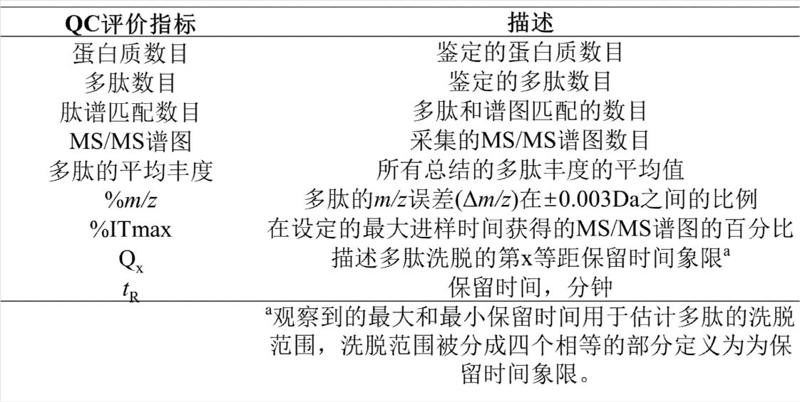

> 2024 年 2 月  
>
> **附件：** 蛋白质组学分析方法及应用指导原则公示稿（第一次）

# 蛋白质组学分析方法及应用指导原则

## 一、适用范围

该指导原则适用于蛋白质组学在蛋白质组成及其变化规律、蛋白质翻译后修饰以及蛋白与蛋白之间相互作用方面的分析研究，规范蛋白质组学分析方法建立，分析过程质量控制和数据分析，确保蛋白质组学分析结果的重复性与可靠性。

## 二、蛋白质组学的分析策略

蛋白质组学分析策略主要有三种，即：

1. **自下而上（Bottom-up） - 肽水平蛋白质组学**
2. **自上而下（Top-down） - 完整蛋白质组学**
3. **自中而下（Middle-down） - 亚基水平蛋白质组学**

其中 Bottom-up 目前应用最为广泛，Top-down 和 Middle-down 是 Bottom-up 的较好补充。

### 1. 自下而上（Bottom-up）

使用各种蛋白酶等将蛋白样品酶切成为多肽，基于各种分离技术对肽段混合物进行分离，通过质谱分析技术检测到肽指纹图谱进行多肽的鉴定和定量分析。根据多肽和蛋白之间的对应关系，经蛋白数据库及相关软件分析得到蛋白的定性和相对定量结果。

### 2. 自上而下（Top-down）

直接对整个蛋白质进行分析和鉴定，是全蛋白质分子组成和形态的表征方法。Top-down 方法可以较好地对不同的蛋白质存在形式（proteoforms）进行测定及区分，真实地捕获蛋白质的信息。

### 3. 自中而下（Middle-down）

使用适宜的蛋白酶例如木瓜蛋白酶（Papain）等将蛋白切为分子量约为 25–50 kDa 的亚基片段，随后进行分离与分析，以获得蛋白的相关信息。

## 三、蛋白质组学分析方法

蛋白质组学分析方法需要具备实用性强、多肽和蛋白的检测特性好以及合适的质控过程，保证分析结果的可靠性。同时，蛋白质组学在操作过程中能够处理大量样品。

蛋白质组学分析基本流程主要包括：

1. 蛋白样品的提取、变性还原、酶解与多肽分离富集  
2. 多肽的分析与鉴定  
3. 数据分析  

### 1. 蛋白样品的提取与分离富集

根据所使用的样本选择适宜方法进行蛋白的提取，如采用化学裂解、蛋白沉淀、细胞破碎仪等方法进行样本蛋白提取。采用表面活性剂进行蛋白变性，采用凝胶电泳或色谱技术等对蛋白进行预分离以获得更高纯度的目标分析蛋白，或不经分离将全部蛋白进行后续分析。

#### 1.1 蛋白质提取

蛋白质样品的提取操作过程中对实验结果的影响较大。目前尚无通用方法能够实现针对所有生物样本中蛋白的提取，因此需要对提取方法进行选择和优化，降低因为样品预处理对于实验结果差异的影响。

从细胞、生物组织中提取蛋白质是一个重要步骤。例如，在细胞裂解步骤中，一些蛋白酶可能会从某些细胞器中释放出来，从而加入离子抑制剂避免蛋白降解。自然界可以预测到的大量蛋白质是疏水性的，对于疏水性较强的蛋白质通常需要加入强表面活性剂来提取。

#### 1.2 蛋白质分离与富集

##### 1.2.1 凝胶电泳技术

常用的凝胶电泳分离与富集技术主要包括二维凝胶电泳（2D-PAGE）和等电聚焦（IEF）技术等。

- IEF 技术是使用两性载体电解质（脂肪族多氨基多羧酸）形成连续、稳定的线性 pH 梯度，基于此进行蛋白的电泳分析，依据蛋白分子的静电荷或等电点的不同进行分离。
- 2D-PAGE 技术的第一维一般基于不同蛋白的等电点差异对蛋白进行分离，第二维基于蛋白间分子量的不同，采用 SDS-PAGE 对蛋白进行分离。

2D-PAGE 技术的分离效果较好，其可将复杂样品中的蛋白较好的分离出来，为后续的实验提供样本。此外，其具有较高的灵敏度和分辨率，可以检测到低表达的蛋白、蛋白修饰和异构体等，但同时也存在难以分离分子质量过大或过小的蛋白质，实验的重复性相对较差等特点。

##### 1.2.2 色谱技术

蛋白质组学中常用的色谱分离技术主要包括反相色谱、离子交换色谱、分子排阻色谱、亲和色谱和多维液相色谱等。

根据样品中蛋白的不同性质，选择合适的固定相，利用不同的色谱分离机制实现对样品中蛋白的分离：

- 反相色谱：基于蛋白与固定相色谱填料之间的疏水性差异进行分离；
- 离子交换色谱：根据蛋白的带电性进行分离；
- 分子排阻色谱：使用适当孔径大小的柱填料，对具有不同分子量的蛋白样品进行分离；
- 亲和色谱：利用蛋白与特定配体（如受体、抗体等）的亲和作用进行分离；
- 多维液相色谱：将样品通过不同的液相色谱柱，基于不同的分离原理实现蛋白质样品的多层次、高效分离。

...

